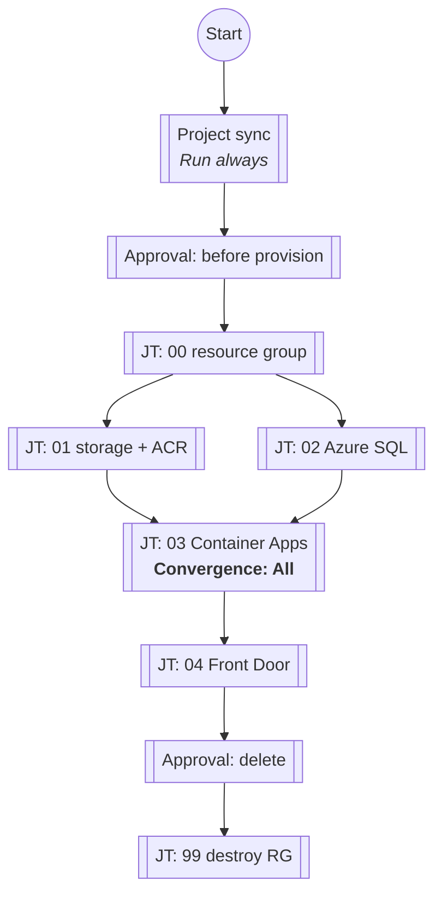
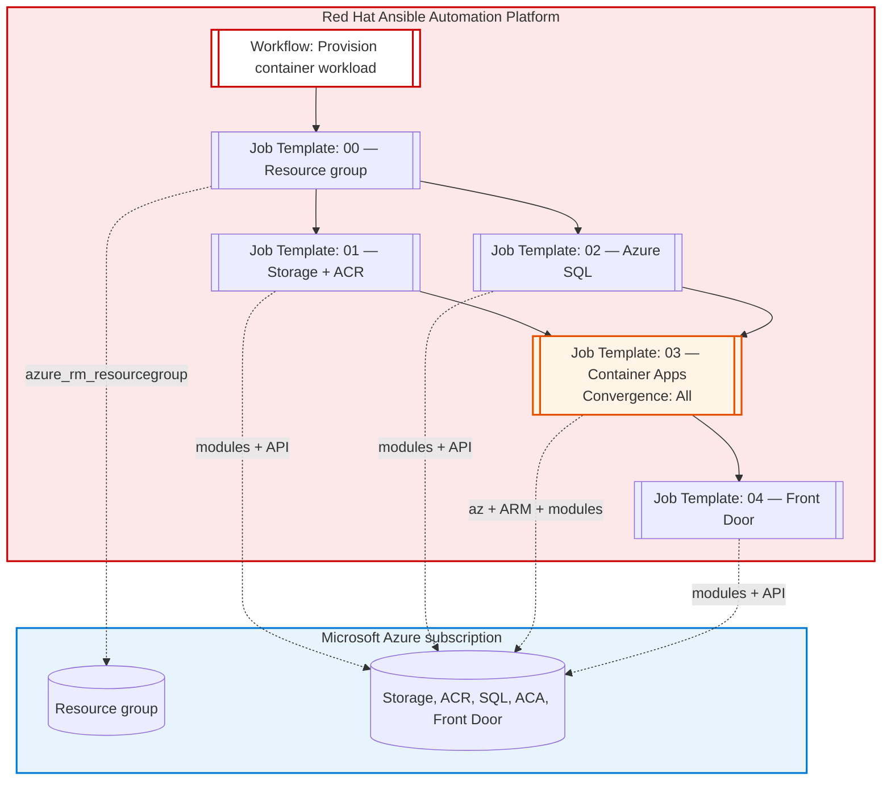

# AAP job workflow — Azure container workload

This document maps the numbered playbooks in this directory to **Red Hat Ansible Automation Platform (AAP)** concepts: **Workflows**, **Job Templates**, convergence, and where **parallel** jobs are safe. The platform is the **control plane** (RBAC, credentials, execution environments, audit, notifications); Azure is the **target**.

For playbook details and variables, see `CONTAINER_WORKLOAD.md`.

---

## Checked: your AAP Workflow Visualizer

Compared to the diagram and rules below, a Controller workflow that looks like **Start → Project sync (Run always) → Approval → 00 → [01 ∥ 02] → 03 → 04 → Delete approval → 99** is **correct** for this repo **if** the convergent node is configured as below.

| Piece | Check |
|--------|--------|
| **Project sync** first, **Run always** | Good: refreshes the SCM **Project** so job nodes use the latest playbooks even if the template branch moved. |
| **Approval** before **00** | Good: human gate before any Azure write. |
| **00** then **01** and **02** in parallel, **Run on success** | Matches the only safe parallel slice (both need only the resource group). |
| **Convergence on node `03` = All (required)** | Automation controller defaults convergent nodes to **Convergence: Any**. For this stack you must set the **`03` workflow node** to **Convergence: All** so **`03` runs only after both `01` and `02` succeed**. With **Any**, `03` can be eligible to run as soon as **one** parallel parent meets the edge rule, which can start the Container Apps job **before ACR exists** (if SQL finished first) or before SQL exists—both are wrong for this design. In the Workflow Visualizer, an **All** node is labeled **ALL**. |
| **03** then **04**, sequential | Correct: **04** needs the ARM deployment output from **03**. |
| **Delete approval** then **99** | Valid for **throwaway demos**: approvers **deny** to keep the environment, **approve** only when you intend to tear down the whole resource group. For long-lived environments, prefer moving **99** to a **separate workflow** so a successful provision never sits one approval away from destroy. |

Full path (aligned with the Visualizer), including **Run always** on project sync:

---

## Workflow diagram (AAP-centric)

Each rounded box is a **Job Template** you create in AAP (same **Project**, same **Credential**, same **Execution Environment** with `azure.azcollection` and, for job **03**, Azure CLI). After **00**, **01** and **02** are parallel; **03** has **two parents** and must use **Convergence: All** in the Workflow Visualizer (see above).

**Convergence on `03`:** In automation controller, a node with multiple incoming success links defaults to **Convergence: Any** unless you change it. Set **`03` to Convergence: All** so it runs **once** only after **both** **01** and **02** succeed (ACR exists, SQL exists). Otherwise **`03` can run too early** relative to **01**/**02**.

---

## Parallel execution

| After step | Can run in parallel? | Notes |
|------------|----------------------|--------|
| **00** | **Yes — 01 and 02** | Both only require the resource group. No shared state between them in Azure beyond the same `resource_group_name`. |
| **01 + 02** → **03** | **No** | **03** needs **ACR** from **01**. In AAP, set the **`03` workflow node** to **Convergence: All** so **03** waits for **both** parents (not default **Any**). |
| **03** → **04** | **No** | **04** reads the ARM deployment output for the Container App FQDN created in **03**. |
| **99** (destroy) | **Never parallel** with **00–04** | Do not run **99** alongside provision nodes. Either use a **separate workflow** for teardown, or (as in a typical demo) chain **99** after **04** behind a **Delete approval** so the default is “deny” unless you explicitly want the resource group removed. |

**Summary:** The only **parallel** slice in the provision path is **Job Template 01** and **Job Template 02** immediately after **00**. Everything else is strictly sequential.

---

## Optional AAP workflow layout (text)

1. **Start** → Workflow launched (manual, schedule, or **Webhook** / **Survey**).
2. **Node:** `project/00_create_workload_resource_group.yml` (always first).
3. **Parallel split:** two nodes with the same parent **00**:
   - `project/01_create_storage_and_acr.yml`
   - `project/02_create_azure_sql.yml`
4. **Node:** `project/03_create_container_apps_sample.yml` — edit this node in the Visualizer and set **Convergence** to **All** so it runs only after **both** **01** and **02** succeed (node shows **ALL** in the graph).
5. **Node:** `project/04_create_front_door_standard.yml`.
6. **End** → optional **Notification** template, **Job slicing** off (N/A here), or export **Analytics** / **Event** stream for SIEM.

**Teardown:** Either (a) a **second workflow** with only `project/99_destroy_workload_resource_group.yml` plus **RBAC**, or (b) the same workflow after **04** with a **Delete approval** node immediately before **99** (as in your Visualizer)—option (b) is fine for labs if operators know to **reject** the delete step to retain the stack.

---

## Stickiness: what stays on AAP (not in Git alone)

- **Who** ran the workflow, **when**, and **what** changed (job output, stdout, Tower/AAP **Activity stream**).
- **Credentials** and **surveys** (unique names per environment without editing playbooks).
- **Execution environment** pin (collection + Python + `az` for job **03**).
- **Workflow policies** (on failure: stop vs continue), **labels**, and **instance groups** / **capacity** where jobs land.

The playbooks in Git remain **idempotent** and **ordered**; AAP adds **orchestration**, **parallelism where safe**, and **governance** around them.
