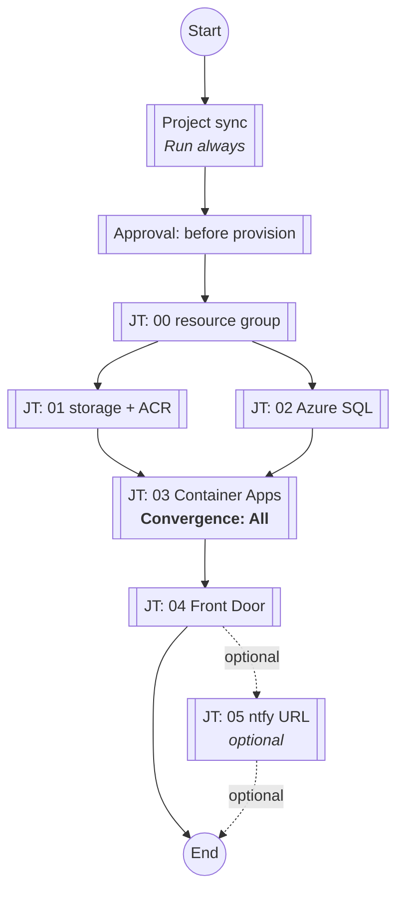
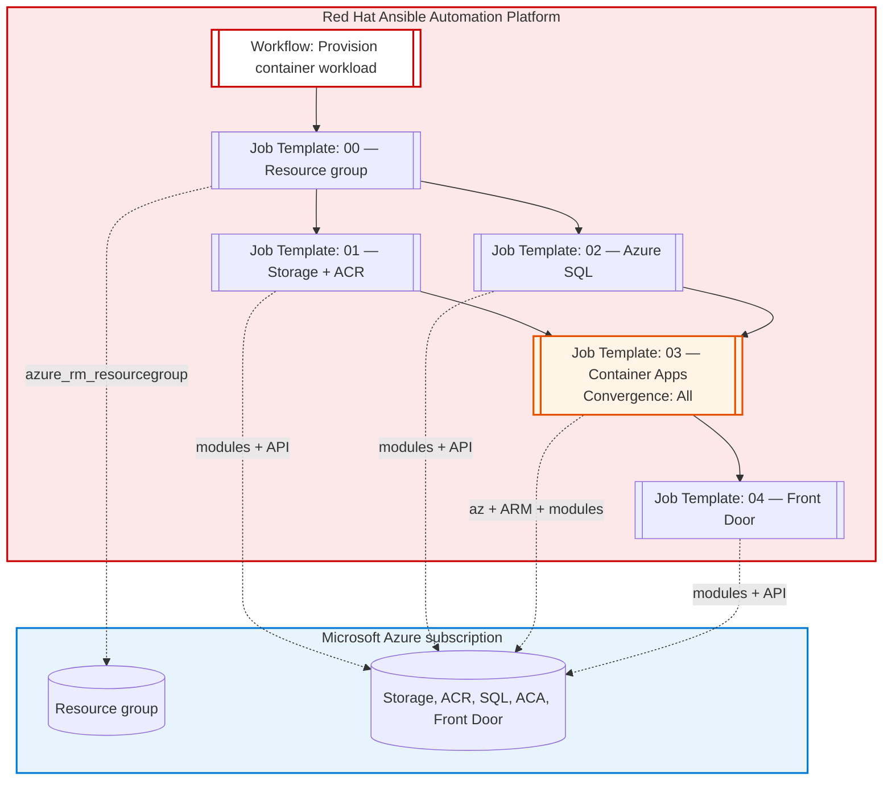

# AAP job workflow — Azure container workload

This document maps the numbered playbooks in this directory to **Red Hat Ansible Automation Platform (AAP)** concepts: **Workflows**, **Job Templates**, convergence, and where **parallel** jobs are safe. The platform is the **control plane** (RBAC, credentials, execution environments, audit, notifications); Azure is the **target**.

For playbook details and variables, see `CONTAINER_WORKLOAD.md`.

---

## Checked: your AAP Workflow Visualizer

Compared to the diagram and rules below, a Controller workflow that looks like **Start → Project sync (Run always) → Approval → 00 → [01 ∥ 02] → 03 → 04 → (optional 05) → End** is **correct** for this repo **if** the convergent node is configured as below.

| Piece | Check |
|--------|--------|
| **Project sync** first, **Run always** | Good: refreshes the SCM **Project** so job nodes use the latest playbooks even if the template branch moved. |
| **Approval** before **00** | Good: human gate before any Azure write. |
| **00** then **01** and **02** in parallel, **Run on success** | Matches the only safe parallel slice (both need only the resource group). |
| **Convergence on node `03` = All (required)** | Automation controller defaults convergent nodes to **Convergence: Any**. For this stack you must set the **`03` workflow node** to **Convergence: All** so **`03` runs only after both `01` and `02` succeed**. With **Any**, `03` can be eligible to run as soon as **one** parallel parent meets the edge rule, which can start the Container Apps job **before ACR exists** (if SQL finished first) or before SQL exists—both are wrong for this design. In the Workflow Visualizer, an **All** node is labeled **ALL**. |
| **03** then **04**, sequential | Correct: **04** needs the ARM deployment output from **03**. |
| **04** then **05** (optional) | **05** posts the Front Door URL to ntfy. See [AAP: ntfy (playbook 05)](#aap-ntfy-playbook-05) below. |

Full path (aligned with the Visualizer), including **Run always** on project sync:

---

## AAP: ntfy (playbook 05)

To send the **Front Door HTTPS URL** to **ntfy** (`ntfy.sh/rh-azure-aca-deployment` by default):

1. **Job template** — Create a template that runs playbook `project/05_send_ntfy_deployment_url.yml` (same **Project** and **Inventory** with `localhost` as for **00–04**).
2. **Credential** — Use the same **Microsoft Azure Resource Manager** credential as the other Azure playbooks. Playbook **05** calls `azure_rm_afdendpoint` to read the endpoint hostname when **`front_door_url`** is not passed in extra vars.
3. **Execution environment** — Same image as **04** (needs `azure.azcollection`). The EE (or instance group network path) must allow **outbound HTTPS to `ntfy.sh`** (TCP 443). Corporate proxies may require an allowlist entry.
4. **Workflow** — Add a node **after** **04** on **On success**, pointing to the **05** job template. Omit this node if you do not want ntfy.
5. **Extra variables (optional)** — Override defaults without editing Git, for example:
   - `ntfy_topic` — default `rh-azure-aca-deployment`
   - `ntfy_server` — default `ntfy.sh` (host only; the playbook always uses `https://`)
   - `ntfy_message` — optional full notification body (default is `Your app deployed successfully, url: <Front Door URL>`)
   - `front_door_url` — if set (e.g. from a survey), **05** skips the Azure read and uses that URL in the default message (useful if Azure API access is restricted on a dedicated notification template).

**Survey:** Not required for the default flow (URL is resolved from Azure). Add a survey only if operators must paste a URL or override the topic per run.

**Teardown:** Run `project/99_destroy_workload_resource_group.yml` from a **separate workflow** (and job template), with RBAC limited to who may destroy the resource group.

### Workflows: ACA demo vs storage visibility (10–11)

**ACA application workflow (unchanged):** Use the sequence already described in this file: **00 → (01 ∥ 02) → 03** with **Convergence: All** on **03** → **04** → optional **05**. Same **Project**, **Credential**, and **Execution Environment** as today; **03** and **10** both need **Azure CLI** (`az`) in the EE.

**Storage visibility workflow:** Provisions a **second** Container App in the **same** resource group and managed environment as **03**, serves the storage HTML report from that app, adds a **separate** Front Door endpoint + origin group + route to that app (playbook **04** is unchanged and still owns the demo app FD route). Typical chain:

1. **Prerequisite:** The ACA stack already exists (run the **ACA workflow** through **04** once), *or* run **00 → 01 ∥ 02 → 03 (All) → 04** in the same way so **ACR**, **ACA env**, **main app**, and **FD profile** exist.
2. **10** — `project/10_azure_storage_visibility_report.yml` (incremental ARM + `az acr import` + FD visibility stack). Re-run whenever you want an updated report in the visibility app.
3. **11** — `project/11_send_ntfy_report_url.yml` (ntfy; needs HTTPS to **ntfy.sh**).

**Combined in one Controller workflow:** After **04** (and optional **05**), add nodes **10 → 11** on success so operators get the **visibility** Front Door URL (different hostname than the demo app endpoint).

**`set_stats` from 10 for downstream jobs:** `report_url` (visibility Front Door HTTPS), `report_local_path`, `visibility_container_app_url` (direct ACA URL for the report app).

**Variables:** `project/vars/azure_visibility_defaults.yml` (visibility app name, ARM deployment name, FD names). Override `aca_visibility_container_app_name` / `azure_visibility_frontdoor_endpoint_name` if Azure reports a naming conflict.

---

## Workflow diagram (AAP-centric)

Each rounded box is a **Job Template** you create in AAP (same **Project**, same **Credential**, same **Execution Environment** with `azure.azcollection` and, for job **03**, Azure CLI). After **00**, **01** and **02** are parallel; **03** has **two parents** and must use **Convergence: All** in the Workflow Visualizer (see above).

**Convergence on `03`:** In automation controller, a node with multiple incoming success links defaults to **Convergence: Any** unless you change it. Set **`03` to Convergence: All** so it runs **once** only after **both** **01** and **02** succeed (ACR exists, SQL exists). Otherwise **`03` can run too early** relative to **01**/**02**.

---

## Parallel execution

| After step | Can run in parallel? | Notes |
|------------|----------------------|-------|
| **00** | **Yes — 01 and 02** | Both only require the resource group. No shared state between them in Azure beyond the same `resource_group_name`. |
| **01 + 02** → **03** | **No** | **03** needs **ACR** from **01**. In AAP, set the **`03` workflow node** to **Convergence: All** so **03** waits for **both** parents (not default **Any**). |
| **03** → **04** | **No** | **04** reads the ARM deployment output for the Container App FQDN created in **03**. |
| **04** → **05** | **No** (optional **05**) | **05** is notification only; chain after **04** if your EE can reach **ntfy.sh**. |
| **04** → **10** | **No** | **10** needs the **FD profile** and **ACA env** from **04**/**03**; it adds a second ACA and a second FD endpoint (same EE needs **`az`** as **03**). |
| **10** → **11** | **No** (optional **11**) | **11** is ntfy only; chain after **10** on success. |
| **99** (destroy) | **Separate workflow** | Do not chain **99** in the provision workflow. Use another workflow and job template for teardown so a routine provision run never ends in destroy. |

**Summary:** The only **parallel** slice in the provision path is **Job Template 01** and **Job Template 02** immediately after **00**. Everything else is strictly sequential.

---

## Optional AAP workflow layout (text)

1. **Start** → Workflow launched (manual, schedule, or **Webhook** / **Survey**).
2. **Node:** `project/00_create_workload_resource_group.yml` (always first).
3. **Parallel split:** two nodes with the same parent **00**:
   - `project/01_create_storage_and_acr.yml`
   - `project/02_create_azure_sql.yml`
4. **Node:** `project/03_create_container_apps_sample.yml` — edit this node in the Visualizer and set **Convergence** to **All** so it runs only after **both** **01** and **02** succeed (node shows **ALL** in the graph).
5. **Node:** `project/04_create_front_door_standard.yml`.
6. **Optional node:** `project/05_send_ntfy_deployment_url.yml` — posts the Front Door URL to ntfy (see [AAP: ntfy (playbook 05)](#aap-ntfy-playbook-05)).
7. **End** → optional **Notification** template, **Job slicing** off (N/A here), or export **Analytics** / **Event** stream for SIEM.

---

## Stickiness: what stays on AAP (not in Git alone)

- **Who** ran the workflow, **when**, and **what** changed (job output, stdout, Tower/AAP **Activity stream**).
- **Credentials** and **surveys** (unique names per environment without editing playbooks).
- **Execution environment** pin (collection + Python + `az` for job **03**).
- **Workflow policies** (on failure: stop vs continue), **labels**, and **instance groups** / **capacity** where jobs land.

The playbooks in Git remain **idempotent** and **ordered**; AAP adds **orchestration**, **parallelism where safe**, and **governance** around them.
